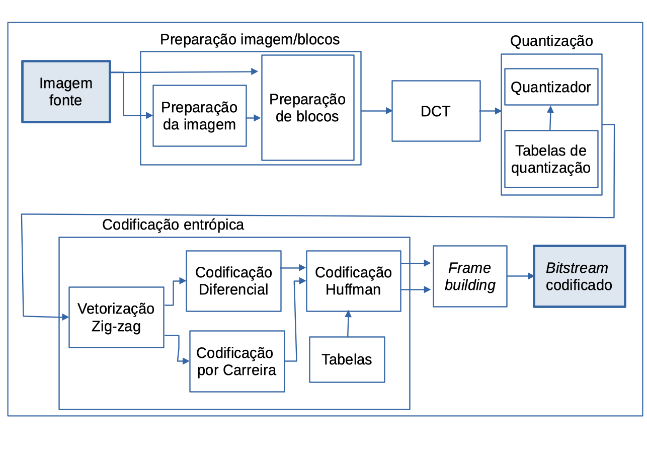

# JPEG_Compressor

## Descrição geral
O presente repositório contém uma implementação do *pipeline* de compressão do padrão JPEG capaz de comprimir imagens BMP. 
O *pipeline* implementado é representado na figura a seguir:



Informações detalhadas sobre cada uma destas etapas podem ser encontradas na documentação do código fonte ou, para uma discussão teórica mais organizada, consultadas no artigo [JPEG](https://en.wikipedia.org/wiki/JPEG). O respositório contém também um descompressor para o compressor implementado, que consiste essencialmente na realização das operações inversas das operações do *pipeline*.

## Organização
```text
JPEG_Compressor/
│
├── assets      # Imagens de exemplo utilizadas no arquivo readme.md
├── test_imgs   # Imagens de teste para a compressão e descompressão
└── src/        # Código fonte da implementação
    ├── BMP_ColorElements       # Código da etapa de preparação da imagem
    │   ├── BMP_ColorElements.c
    │   ├── BMP_ColorElements.h
    │  
    ├── BMP_Header              # Código para ler e escrever no header de imagens BMP
    │   ├── BMP_header.c
    │   ├── BMP_header.h
    │ 
    ├── CodEntropica            # Código da etapa de codificação entrópica
    │   ├── CodEntropica.c
    │   ├── CodEntropica.h
    │ 
    ├── Compressao              # Código das etapas de compressão sem perdas (Codificação Diferencial, Por Carreira e Huffman)
    │   ├── Compressao.c
    │   ├── Compressao.h
    │ 
    ├── DCT                     # Código da etapa da transformada DCT
    │   ├── DCT.c
    │   ├── DCT.h
    │ 
    ├── jpeg                    # Código para compressão e descompressão completa do padrão JPEG
    │   ├── jpeg.c
    │   ├── jpeg.h
    │ 
    ├── matrix                  # Código de implementação da estrutura de dados matriz
    │   ├── matrix.c
    │   ├── matrix.h
    │ 
    ├── quant                   # Código da etapa de quantização
    │   ├── quant.c
    │   ├── quant.h
    │ 
    ├── main.c  # Função principal
    ├── makefile # Código de compilação
```

## Utilização
* Copie o repositório para sua máquina: 
	```bash
	git clone https://github.com/LucasDNA17/JPEG_Compressor
	```
* Acesse o diretório de código fonte:
	```bash
	cd JPEG_Compressor/src
	```
* Compile o código fonte:
	```bash
	make
	```
* Execute o código compilado: 
	```bash
	make run
	```
* Informe o nome exato da imagem a ser comprimida, que deve estar neste diretório:
	```bash
	exemplo.bmp
	```
Exemplos de imagens teste podem ser encontradas no diretório test_imgs.